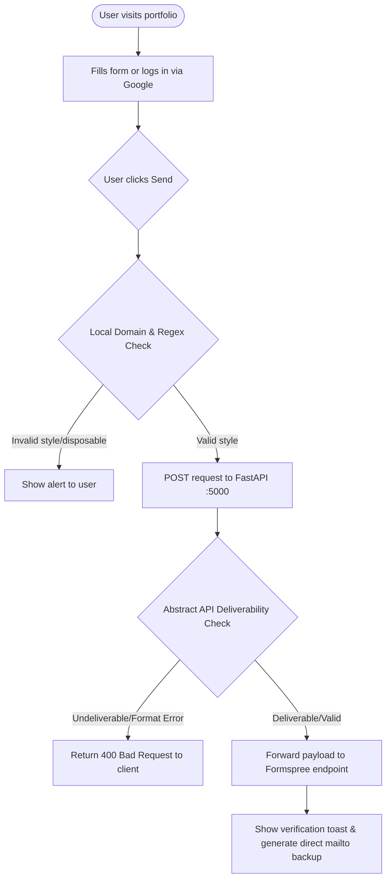

# Hashir Butt | AI & Backend Engineer Portfolio

A premium, interactive personal portfolio website showcasing software engineering expertise in Generative AI, LLM orchestration, FastAPI microservices, and real-time computer vision.

This project features a fully functional asynchronous contact form that validates user email addresses in real-time (detecting disposable or invalid addresses) before forwarding messages safely to your inbox.

---

## 🛠️ Tech Stack

- **Frontend**: HTML5, Vanilla JavaScript, Tailwind CSS (CDN), FontAwesome, AOS (Animate on Scroll).
- **Authentication/Integrations**: Google Sign-In Identity Services (pre-fills user information and guarantees verified email addresses).
- **Backend API**: FastAPI (Asynchronous Python framework), HTTPX (asynchronous requests).
- **Integrations**: 
  - **Abstract API** (real-time email validation).
  - **Formspree** (email delivery).

---

## 📂 Project Structure

```
Hashir-Portfolio/
│
├── index.html          # Portfolio frontend layout, styles, and client-side logic
├── main.py            # FastAPI backend server handling contact validation and dispatching
├── requirements.txt   # Backend Python package dependencies
├── profile.png        # Profile picture asset
├── .gitignore         # Prevents tracking cache/virtualenv/secrets files
└── README.md          # Project documentation (this file)
```

---

## 🚀 Getting Started (Local Run)

Follow these instructions to configure and run the portfolio locally on your machine.

### Prerequisites
- Python 3.8 or higher installed on your computer.
- An **Abstract API** key (for email validation verification).
- A **Formspree** endpoint (for receiving messages).

---

### Step 1: Set Up the FastAPI Backend

1. **Clone or open the workspace directory**:
   ```bash
   cd Hashir-Portfolio
   ```

2. **Create a virtual environment (Recommended)**:
   ```bash
   python -m venv venv
   ```

3. **Activate the virtual environment**:
   *   **Windows (PowerShell)**:
       ```powershell
       .\venv\Scripts\Activate.ps1
       ```
   *   **macOS / Linux**:
       ```bash
       source venv/bin/activate
       ```

4. **Install Python dependencies**:
   ```bash
   pip install -r requirements.txt
   ```

5. **Configure environment variables**:
   Create a file named `.env` in the root directory:
   ```env
   ABSTRACT_API_KEY=your_abstract_api_key_here
   ```
   *(Note: The backend has a default key fallback, but using your own ensures quota limits are isolated to your workspace).*

6. **Start the FastAPI backend server**:
   We must bind it to port `5000` because the frontend expects the backend to run on port 5000:
   ```bash
   uvicorn main:app --reload --port 5000
   ```
   You should see uvicorn start successfully on `http://127.0.0.1:5000`.

---

### Step 2: Set Up the Frontend

1. Ensure the backend server is running in the background.
2. Open [index.html](index.html) in your browser:
   * Double-click [index.html](index.html) to open it directly in a web browser.
   * Or run a simple HTTP server in the root directory:
     ```bash
     python -m http.server 8080
     ```
     Then navigate to `http://localhost:8080` in your web browser.

3. Test the contact form:
   * Try logging in via the **Google Sign-In** button to verify and auto-fill your email and name.
   * Try using invalid domain emails (like `test@test.com` or `spam@mailinator.com`) to check the client-side/server-side validation filters.

---

## 📧 How the Contact Flow Works


